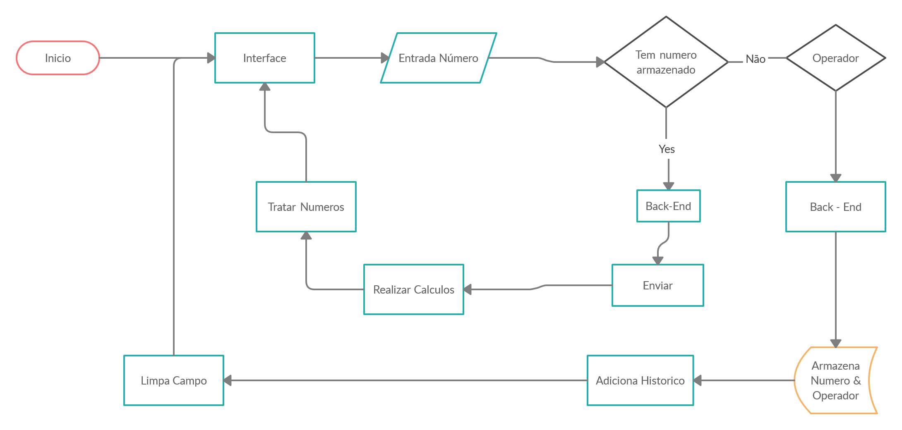
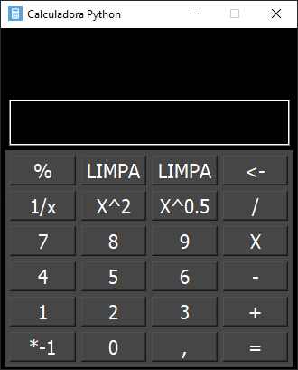

# MyCalc-Python

## Descrição

A simple Calculator with PySide2, PyQt5 and some functions

## Como Usar

### Instalando

Instalar Requisitos:
```pip install PySide2``` &
```pip install PyQt5```<br />
Clonar este repositorio: ```git clone https://github.com/kilerhg/MyCalc-Python.git```<br />

## Abrindo

Abrir o Cmd ou PowerShell Na pasta e rodar o comando: ```python janela.py```

## Task-List

- [x] Criar Funções Basicas
- [x] Criar Modulo e Inserir as Funções
- [x] Testar As Funções reagindo com a GUI arcaica 
- [x] Criar Gui para Calculadora (Basico)
- [x] Criar os Sinais ligando as funções Com o Gui
- [x] Melhorar Desing Gui
- [x] Melhorar Os Sinais
- [x] Criar Loop De Resultado
- [x] Compilar para .EXE
- [ ] Criar Historico das Contas Realizadas
- [ ] Criar Aba para salvar as contas Realizadas

## Fluxograma Funcionamento




## Screenshot


